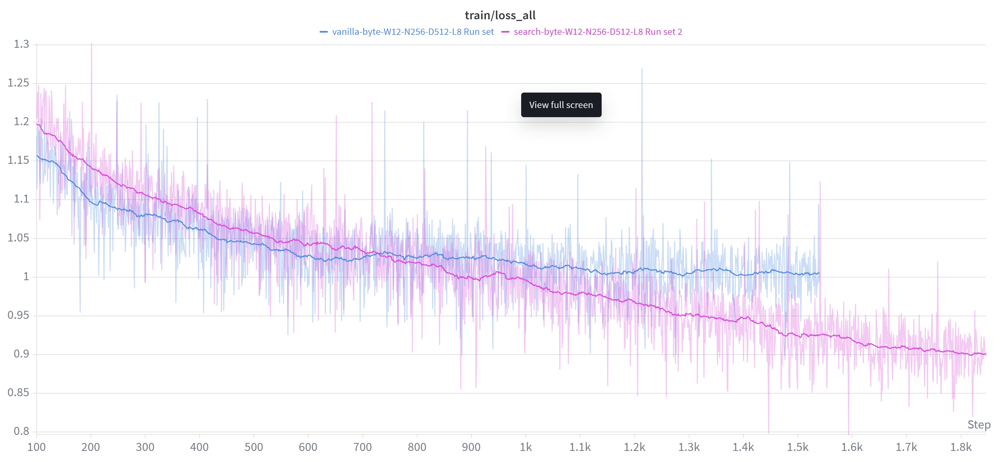
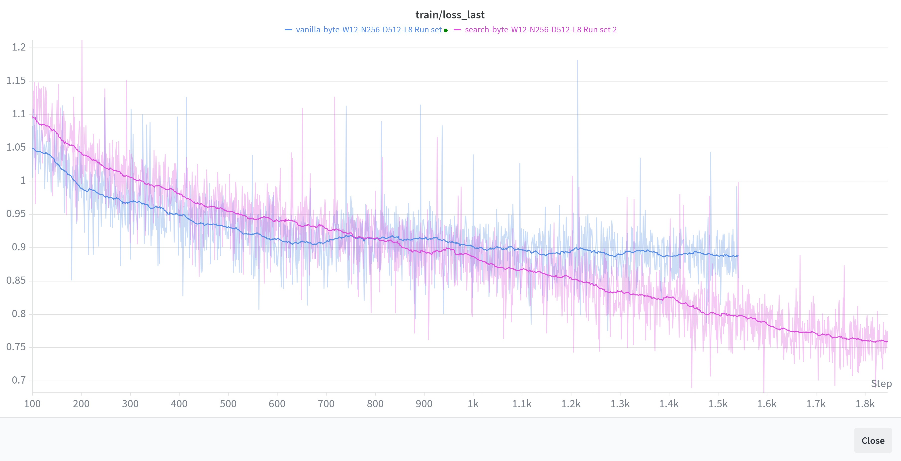

# Search Head Transformer

> **Work in progress.** Results, ablations, and additional code will be added as experiments progress.
>
> All ideas and architecture decisions are human. Code and reports were written with AI assistance.

**A confidence-based search mechanism at the output layer that replaces the standard linear projection with learned context retrieval.**

Instead of predicting the next token from a single hidden state `h[t]`, the search head pairs `h[t]` with every previous embedding `h[j]` and selects the pair that produces the most confident prediction. This simple change yields a **0.35 BPC improvement** over concatenation baselines at 2B characters of training.

> The search head transforms the transformer from a batch sequence processor into a reactive system with non-blocking read access to an evolving information environment.

---

## How It Works

### Two-Phase Forward Pass

```
Input tokens → Transformer Backbone → Hidden states h[0..T-1]
                                              ↓
                            Phase 1 (no grad): Search all pairs
                            Score each (h[t], h[j]) by max softmax probability
                                              ↓
                            Phase 2 (with grad): Selected pair only
                            Logits = MLP(h[t] || h[best_j])
```

**Phase 1** evaluates all T×(T-1)/2 causal pairs through the MLP head without gradients. The pair producing the highest-confidence output distribution wins.

**Phase 2** recomputes only the selected pair with gradients enabled. The backbone learns to produce embeddings that are *searchable* — Phase 1's selection pressure shapes the entire representation.

### Why It Works

The search head creates a **self-supervised curriculum**. At each position, the model finds whichever previous context embedding most reduces its uncertainty about the next token. This is strictly more powerful than attending to fixed recent positions (concat-K) because:

- The relevant context position varies per token (sometimes it's the function signature 200 tokens ago, sometimes it's the previous character)
- The search is learned end-to-end — the backbone adapts its representations to be retrievable
- No context window is consumed — the search result enters as a single D-dimensional vector

### Results



After 10 billion characters of training (~1,000 epochs), the vanilla transformer's loss flattens — it has extracted what it can from fixed-position prediction. The search head transformer continues to decrease, with no sign of plateauing. The search mechanism provides a richer learning signal: as the backbone improves, better embeddings enable better search, which in turn produces harder training pairs. This feedback loop sustains learning long after the vanilla model has saturated.

### Last-Position Loss



The final position in the context window — the one that matters most during actual generation — reaches a loss of 0.76 (1.1 BPC) after 18.4 billion characters of training. In real use, the model always predicts from the last position, so this is the metric that directly determines generation quality. 

1.1 BPC is quite good for a model with only 28 million parameters.

### Non-Degenerate Search

The model doesn't trivially select position `t-1`. The metric `frac_t_minus_1` stays at ~1% (below the 2.2% uniform random baseline), confirming the search learns meaningful long-range retrieval patterns.

---

## Architecture Details

- **Backbone:** Decoder-only transformer with Temporal Split Attention
  - Half the attention heads attend to the last W=12 positions (local syntax)
  - Half attend only to positions older than W (long-range dependencies)
- **Head:** `Linear(2D → 2048) → GELU → Linear(2048 → V)`
- **Training:** AdamW, cosine LR schedule, mixed precision (AMP), dual dataset (FineWeb-Edu + CodeParrot)
- **Byte-level model:** V=256, D=512, 8 heads, 8 layers, block_size=256
- **BPE-4096 variant:** Same backbone, sentencepiece tokenizer

---

## The Vision: From Search to System Architecture

The search mechanism is a general-purpose communication primitive. The [full architecture report](docs/architecture.md) describes the complete vision:

### Multi-Buffer Search (Memory-Mapped I/O for Transformers)

The search head generalizes to multiple external buffers — each searched autoregressively in priority order:

```
Step 1: score(h[t], 0,          0,        0,          candidate_local) → best_local
Step 2: score(h[t], best_local, 0,        0,          candidate_rag)   → best_rag
Step 3: score(h[t], best_local, best_rag, 0,          candidate_agent) → best_agent
Step 4: score(h[t], best_local, best_rag, best_agent, candidate_human) → best_human
```

This is **not permutation invariant** — the ordering is architectural. Each search is conditioned on the results of all prior searches, like a CPU's memory hierarchy (registers → L1 → L2 → RAM → disk).

**Non-blocking communication:** The model never stops generating to check its inputs. At every token, it searches all buffers as part of its forward pass. A human can type feedback mid-generation and the model picks it up at the next relevant token — no restart needed.

### Why This Matters: Enabling Pure Reasoning Models

Karpathy's vision is a model that reasons powerfully but doesn't try to memorize all of Wikipedia in its weights. The search head makes this concrete through two mechanisms:

1. **Unbounded external context (the hard drive).** The RAG buffer can hold millions of embeddings — entire codebases, documentation, knowledge bases — without consuming a single context token. The model accesses them through O(1) search, not O(n) attention. This is the "hard drive" that lets a small model punch above its weight class.

2. **Memory-mapped I/O (the bus).** The buffers are asynchronous and non-blocking. Information from humans, other models, file watchers, and databases flows into the model's search space continuously — just like hardware peripherals writing to memory-mapped registers. The model doesn't need to stop, re-prompt, or restart. It reads what it needs, when it needs it, as a natural part of generating each token.

Together, these turn the transformer into something closer to a CPU: a compact reasoning core with a uniform interface to an arbitrarily large, asynchronously-updated information environment. The model's weights encode *how to think*, not *what to know*.

### Multi-Core Generation

Multiple generation streams (cores) share buffers and search each other's hidden states:

```
┌─────────────┐       search        ┌─────────────┐
│   Core 0    │◄────────────────────►│   Core 1    │
│   (coder)   │                      │  (reviewer) │
└──────┬──────┘                      └──────┬──────┘
       │                                     │
       └───────── shared buffers ────────────┘
            (RAG, external models, human)
```

Cores communicate through **latent states**, not text. Core 1 (reviewer) can reason about Core 0's (coder) code *as it emerges*, without waiting for completion.

### Cross-Model Communication

Foreign models (different architecture, different weights) participate through a text gateway:

```
Foreign model output (text) → Your backbone (frozen) → Native embeddings → Searchable buffer
```

Any model that produces text can join the buffer system. Same-weights peers get rich per-token hidden state access; foreign models get a slightly lossy but fully functional channel through text re-encoding.

### Compute Economics

The search head compresses early training, spending ~80% more compute on hard patterns:

```
Vanilla:     [======= easy patterns =======][=== hard patterns ===]
Search head: [== easy ==][============ hard patterns ============]
```

---

## Repository Structure

```
search-head-transformer/
├── README.md                              # This file
├── docs/
│   ├── architecture.md                    # Full architecture report
│   └── experiments.md                     # Planned and in-progress experiments
├── src/
│   ├── search_head_byte.py                # Byte-level search head (V=256)
│   ├── search_head_bpe.py                 # BPE-4096 variant
│   ├── search_head_external_buffer.py     # External buffer post-training (Experiment 3)
│   ├── concat_k_baseline.py              # Concat-K=5 baseline for comparison
│   └── vanilla_baseline.py               # Vanilla linear head baseline
├── requirements.txt
└── LICENSE
```

---

## Quick Start

```bash
# Install dependencies
pip install -r requirements.txt

# Train byte-level model
python src/search_head_byte.py --wandb-project search-head

# Train BPE-4096 model (auto-trains tokenizer on first run)
python src/search_head_bpe.py --wandb-project search-head

# Post-train with external buffer (loads pretrained byte-level checkpoint)
python src/search_head_external_buffer.py --wandb-project search-head

# Resume from checkpoint
python src/search_head_byte.py --resume
python src/search_head_external_buffer.py --resume
```

### Baselines

Two baseline models are included in `src/` for fair comparison. They share the exact same backbone (Temporal Split Attention, D=512, 8 layers, 8 heads), data pipeline, and training schedule — only the output head differs:

```bash
# Concat-K=5: MLP over last 5 concatenated embeddings
python src/concat_k_baseline.py --wandb-project search-head

# Vanilla: single linear projection h[t] → logits
python src/vanilla_baseline.py --wandb-project search-head
```

| Model | Output Head | File |
|-------|-------------|------|
| Search Head | `MLP(h[t] \|\| h[best_j])` — searched pair | `search_head_byte.py` |
| External Buffer | `MLP(h[t] \|\| h[best_internal] \|\| h[best_external])` — internal + buffer search | `search_head_external_buffer.py` |
| Concat-K=5 | `MLP([h[t], h[t-1], ..., h[t-4]])` — fixed window | `concat_k_baseline.py` |
| Vanilla | `Linear(h[t])` — single embedding | `vanilla_baseline.py` |

### External Buffer (Experiment 3)

Post-training experiment that adds an external buffer search on top of the frozen pretrained search head. The backbone and internal search are frozen; only the new external-embedding columns of the expanded head are trained.

**Architecture:**
- Frozen backbone produces embeddings for both the training sequence and preceding buffer context
- Internal search (frozen): finds `best_internal` from `h[0..t-1]` within the sequence
- External search: finds `best_external` from buffer embeddings (sliding window of `block_size`, stride 1)
- Expanded head: `MLP([h[t], best_internal, best_external])` → logits

**Training strategy:**
- `head.0.weight` expanded from `(2048, 1024)` to `(2048, 1536)` — first 2D columns frozen via gradient mask, last D columns trained
- `head.2.weight` (hidden→vocab) frozen
- Effective trainable parameters: 1,048,576 (2048×512)

```bash
# Default: 256 buffer embeddings, loads best_model_byte.pt
python src/search_head_external_buffer.py

# Custom buffer size
python src/search_head_external_buffer.py --buffer-size 512

# Resume
python src/search_head_external_buffer.py --resume
```

### Requirements

- Python 3.10+
- PyTorch 2.0+ with CUDA
- ~16GB VRAM (for batch_size=10, block_size=256, 8 layers)

---

## Key Hyperparameters

| Parameter | Byte model | BPE model |
|-----------|-----------|-----------|
| Vocab size | 256 | 4096 |
| D (embedding dim) | 512 | 512 |
| Layers | 8 | 8 |
| Heads | 8 | 8 |
| Block size | 256 | 256 |
| Local window W | 12 | 12 |
| Head hidden dim | 2048 | 2048 |
| Learning rate | 1e-4 | 1e-4 |
| Batch size | 10 | 10 |

---

## Training Data

Alternating batches from two streaming datasets:
- **FineWeb-Edu** (odd steps): High-quality web text
- **CodeParrot** (even steps): Python code

---

## Citation

If you use this work, please cite:

```bibtex
@misc{searchhead2026,
  title={Search Head Transformer: Confidence-Based Context Retrieval at the Output Layer},
  author={Anders Movert},
  year={2026},
  url={https://github.com/AndersMovert/search-head-transformer}
}
```

---

## Contact

Reach me on X: [@AndersMovert](https://x.com/AndersMovert)

---

## License

MIT License — see [LICENSE](LICENSE)
